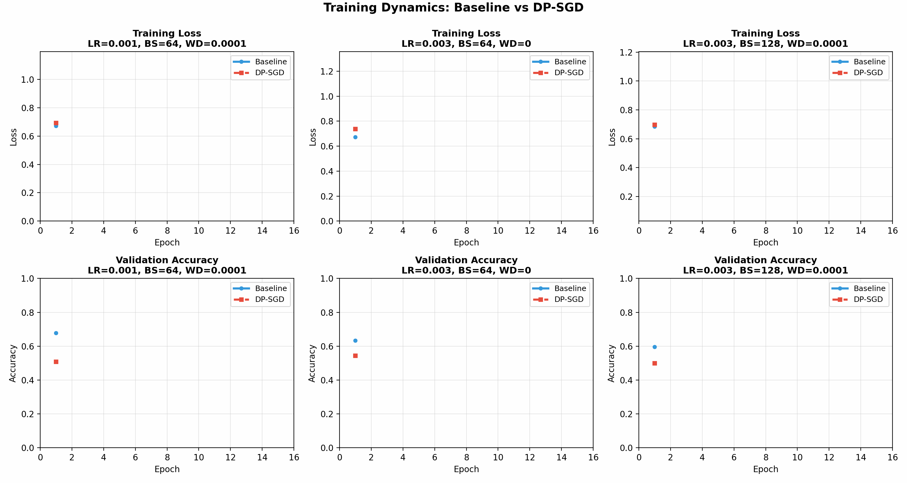

<div align="center">


[](https://medium.com/@carolinedotxyz/teaching-vision-models-to-forget-the-true-cost-of-privacy-in-deep-learning-9e4dc775f6e2)


# Educational SGD vs. DP-SGD Image Classifier
### CelebA — Eyeglasses Attribute Classification

**An end-to-end educational workflow for understanding differential privacy in deep learning**

[Overview](#-overview) • [Quick Start](#-quick-start) • [Features](#-features) • [Project Structure](#-project-structure) • [Documentation](#-documentation)

📖 *For a full conceptual walkthrough, see my accompanying Medium article:*  
[Teaching Vision Models to Forget — The True Cost of Privacy in Deep Learning](https://medium.com/@carolinedotxyz/teaching-vision-models-to-forget-the-true-cost-of-privacy-in-deep-learning-9e4dc775f6e2)


</div>

---

## 📖 Overview

This repository provides a **complete, educational workflow** for training image classifiers with differential privacy. From raw [CelebA](https://mmlab.ie.cuhk.edu.hk/projects/CelebA.html) images to balanced subset creation, preprocessing, baseline CNN training, and differentially private training with **DP-SGD** (via [Opacus](https://opacus.ai/)).

> **Design Philosophy**: Instead of diving straight into opaque training loops, we prioritize **clarity over complexity**. Each stage is observable, testable, and modifiable — designed as a teaching tool.

<div align="center">



*Training dynamics comparison: Baseline SGD vs. DP-SGD*

</div>

### 🎯 Primary Entry Point

**The main entry point is** [`notebooks/celeba_eyeglasses_workflow.ipynb`](notebooks/celeba_eyeglasses_workflow.ipynb)

This notebook provides an **end-to-end educational workflow** where you:

- Analyze the CelebA dataset and create balanced subsets
- Preprocess images with transparent, observable steps
- Train both baseline and DP-SGD models with matched hyperparameters
- Visualize and compare privacy-accuracy trade-offs

> **Note**: All steps are designed for learning. Each stage is observable, testable, and modifiable. Training can also be done programmatically using the modules in `src/training/`, but the notebook is recommended for understanding the complete workflow.

---

## ✨ Features

- **Differential Privacy**: Full DP-SGD implementation using Opacus
- **Educational Focus**: Transparent, well-documented code designed for learning
- **Matched-Pair Methodology**: Identical hyperparameters for baseline and DP-SGD enable direct privacy cost quantification
- **Centralized Configuration**: YAML-based config system for easy experimentation
- **Comprehensive Visualization**: Training curves, privacy-utility tradeoffs, and comparisons
- **Tested & Reproducible**: Full test suite and tracked experiments under `runs/`
- **Automated Workflows**: Hyperparameter sweeps for both baseline and DP-SGD

---

## 🚀 Quick Start

### Prerequisites

- Python 3.8+
- pip

### 1️⃣ Installation

```bash
python -m venv .venv
source .venv/bin/activate  # On Windows: .venv\Scripts\activate
pip install -U pip
pip install -e .[dev]
```

### 2️⃣ Download the Data

1. Download the CelebA dataset from [Kaggle](https://www.kaggle.com/datasets/jessicali9530/celeba-dataset)
2. Extract and place the archive under:
   ```
   data/celeba/archive/
   ```
3. The notebook will validate the expected files/structure automatically

### 3️⃣ Configuration (Optional)

The notebook uses a centralized YAML configuration system. Edit `notebooks/config.yaml` to customize:

- Dataset paths and subset sizes
- Preprocessing parameters
- Training hyperparameters
- Privacy parameters (for DP-SGD)

📖 See [`notebooks/README_config.md`](notebooks/README_config.md) for detailed configuration documentation.

### 4️⃣ Create Subset and Preprocess

Open and run: [`notebooks/celeba_eyeglasses_workflow.ipynb`](notebooks/celeba_eyeglasses_workflow.ipynb)

The notebook will:
- Build a balanced Eyeglasses subset (train/val/test)
- Preprocess images (crop/resize/normalize)
- Save dataset statistics needed by loaders

> These artifacts are required before running training. We keep this step in-notebook to make the process transparent and learnable.

### 5️⃣ Train Models

After preprocessing, you can train models by:

- Continuing in `notebooks/celeba_eyeglasses_workflow.ipynb`
- The notebook includes training cells for both baseline and DP-SGD models
- Uses matched hyperparameters for fair privacy-accuracy comparison
- Includes visualization cells for analyzing results

---

## 🏗️ Project Structure

<details>
<summary><b>Click to expand project structure</b></summary>

```
dp_sgd_classification/
├── data/                    # Dataset storage (CelebA archive, subsets, processed images)
│   └── celeba/
│       ├── archive/         # Raw CelebA dataset
│       ├── subsets/         # Balanced subsets
│       └── processed/       # Preprocessed images
├── notebooks/               # Main workflow notebook, configs, and utilities
│   ├── celeba_eyeglasses_workflow.ipynb  # Primary entry point
│   ├── config.yaml          # Centralized configuration
│   └── README_config.md     # Configuration guide
├── scripts/                 # Standalone CLI scripts for data processing
│   ├── celeba_analyze.py
│   ├── celeba_build_subset.py
│   ├── celeba_preprocess.py
│   └── celeba_centering.py
├── src/                     # Core Python package
│   ├── config/              # Configuration management
│   ├── core/                # Core ML components (models, data loaders, utils)
│   ├── datasets/            # Dataset-specific code (CelebA workflow, analysis)
│   ├── notebooks/           # Notebook utilities (display, setup, helpers)
│   ├── training/            # Training loops, sweeps, visualization
│   └── visualization/       # Plotting utilities
├── tests/                   # Test suite
└── runs/                    # Training run outputs (configs, checkpoints, metrics)
```

</details>

---

## 🧪 Testing

<details>
<summary><b>Click to expand testing instructions</b></summary>

Run the full test suite:

```bash
pytest -q
```

Or run specific test files:

```bash
pytest tests/test_data.py
pytest tests/test_train_baseline.py
pytest tests/test_train_dp.py
```

</details>

---

## 📦 What You'll Find

<details>
<summary><b>Click to expand detailed component descriptions</b></summary>

### Data Processing Scripts (`scripts/`)

| Script | Description |
|--------|-------------|
| `celeba_analyze.py` | Analyze CelebA attribute balance |
| `celeba_build_subset.py` | Create balanced subsets with stratification |
| `celeba_preprocess.py` | Preprocess images (crop/resize/normalize) |
| `celeba_centering.py` | Analyze face centering using landmarks |

### Core Functionality (`src/`)

- **Configuration** (`src/config/`): Centralized YAML-based config system with platform-specific workarounds (e.g., M1 Mac OpenMP fixes)
- **Subset Building** (`src/datasets/celeba/`): Balanced Eyeglasses vs No Eyeglasses, with options to reduce confounding
- **Preprocessing** (`src/datasets/celeba/`): Deterministic center-crop/resize, normalization, and saved dataset stats
- **Training** (`src/training/`): Clear baseline (non-DP) and DP-SGD loops using PyTorch + Opacus
- **Hyperparameter Sweeps** (`src/training/`): Automated grid searches for baseline and DP-SGD
- **Visualization** (`src/visualization/`): Training curves, privacy-utility tradeoffs, and comparisons
- **Notebook Utilities** (`src/notebooks/`): Helper functions for timestamps, config printing, validation

### Notebook Features (`notebooks/`)

- ✅ **Centralized configuration**: YAML-based config system (`config.yaml`) for easy experimentation
- ✅ **Helper utilities**: Reusable functions (`generate_timestamp`, `print_config`, validation helpers)
- ✅ **Cell dependencies**: Clear documentation of global state and dependencies in notebook header
- ✅ **Code quality**: Well-documented, maintainable code following best practices
- ✅ **Matched-pair methodology**: Identical hyperparameters for baseline and DP-SGD enable direct privacy cost quantification

### Additional Features

- 🔄 **Reproducibility**: Configs, metrics, and artifacts tracked under `runs/`
- 📚 **Documentation**: Comprehensive guides in `docs/` for data processing, training, and notebooks

</details>

---

## 🔗 Recommended Reading

<details>
<summary><b>Click to expand learning resources</b></summary>

If you're new to **Differential Privacy**, **DP-SGD**, or the **CelebA dataset**, the following resources provide helpful background:

### Differential Privacy Fundamentals

- **"The Algorithmic Foundations of Differential Privacy" (Dwork & Roth)** — canonical introduction  
  [📄 PDF](https://www.cis.upenn.edu/~aaroth/Papers/privacybook.pdf)

### DP-SGD and Practical Implementations

- **Original DP-SGD Paper: "Deep Learning with Differential Privacy"**  
  [📄 arXiv](https://arxiv.org/abs/1607.00133)

- **Opacus (PyTorch) — DP-SGD Documentation**  
  [🌐 Website](https://opacus.ai/docs)

- **TensorFlow Privacy — DP-SGD Overview**  
  [🐙 GitHub](https://github.com/tensorflow/privacy)

### CelebA Dataset Background

- **CelebA Dataset Paper ("Deep Learning Face Attributes…")**  
  [📄 arXiv](https://arxiv.org/abs/1411.7766)

- **CelebA Dataset Homepage & Documentation**  
  [🌐 Website](http://mmlab.ie.cuhk.edu.hk/projects/CelebA.html)

### General DP Resources (Optional)

- **Apple Differential Privacy Technical Overview**  
  [📄 PDF](https://www.apple.com/privacy/docs/Differential_Privacy_Overview.pdf)

- **Google's RAPPOR (Local DP technique)**  
  [📄 Research Paper](https://research.google/pubs/pub42852/)

</details>

---

## 🛠️ Tech Stack

<details>
<summary><b>Click to expand technology stack</b></summary>

- **Python** 3.8+
- **PyTorch** - Deep learning framework
- **Opacus** - Differential privacy for PyTorch
- **NumPy, Pandas** - Data processing
- **Matplotlib, Seaborn** - Visualization
- **Pytest** - Testing framework

</details>

---

## 🗺️ Roadmap

<details>
<summary><b>Click to expand roadmap</b></summary>

- [ ] Additional privacy budget analysis tools
- [ ] Support for more CelebA attributes
- [ ] Extended visualization capabilities
- [ ] Performance optimizations

</details>

---

## 🙏 Acknowledgments

<details>
<summary><b>Click to expand acknowledgments</b></summary>

- **[CelebA Dataset](https://mmlab.ie.cuhk.edu.hk/projects/CelebA.html)** - The Chinese University of Hong Kong
- **[Opacus](https://opacus.ai/)** - Facebook AI Research for differential privacy tools

</details>

---

<div align="center">

**Built with ❤️ for educational purposes**

</div>
